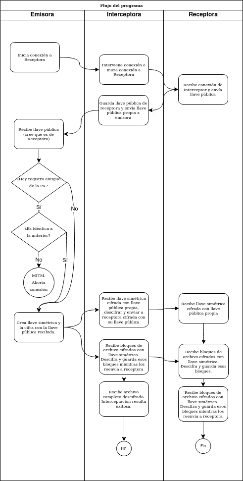

En esta auxiliar veremos una ejemplo de ataque de `Man-in-the-Middle`, con el código que pueden bajar de [este enlace](https://github.com/cc5312/transfer). El código está en python y el README indica qué hacer para dejarlo corriendo.

### ¿Cómo funciona?

El código asume lo siguiente:
* Existe un repositorio autoritativo que mapea nombres con direcciones IP (y puertos). Este repositorio está configurado como un archivo `json` en el sitio del curso: `https://users.dcc.uchile.cl/~eriveros/cc5312/addressbook.json`
* Existen tres modos de uso:
  - `receive`: Recibe un archivo, escuchando en un puerto
  - `send`: Envía un archivo a un `nombre`, el cual es resuelto a IP:Puerto consultando al repositorio autoritativo
  - `mitm`: Intercepta las comunicaciones entre un emisor y un receptor, leyendo el mensaje sin ser detectado (reenviando lo recibido por `send` a `receive`).
* En un uso normal, la persona receptora escucha un intento de conexión de alguna persona emisora. 
* Al haber conexión, la persona receptora envía su llave pública, de forma que la receptora pueda cifrar la llave simétrica que usará para cifrar un archivo más grande.

### ¿Cómo se ejecutaría un ataque?

En este caso, asumimos que emisora y receptora no se han comunicado antes, por lo que la emisora no tiene forma de comprobar que la llave recibida sea la de la receptora.

* Primero, se colocan las IPs y puertos a usar en un archivo `addressbook.json` que esté al alcance de todas las personas participantes.
* Luego, la receptora espera un archivo en el mismo puerto declarado en el `addressbook`.
* En algún momento, la atacante logra modificar el `addressbook` de tal forma que hace que el nombre de la receptora apunte a una IP controlada por ella (atacante).
* La emisora envía un mensaje al nombre de la receptora, pero se rutea a la atacante.
* La atacante reenvía los mensajes recibidos a la receptora para que no se note la interrupción de las comunicaciones. Al mismo tiempo, envía a la emisora su llave pública.
* La atacante recibe de la receptora su llave pública y la guarda para uso posterior. Luego la atacante envía su llave pública a la emisora.
* Si la emisora había visto previamente la llave pública de la receptora, puede compararlas. Si son distintas, puede abortar el protocolo. Si son iguales, puede continuar sabiendo que se está comunicando con la misma persona de la vez pasada. El mayor problema ocurre si es la primera vez que se comunica con la receptora, ya que no tiene forma de saber si es ella quién dice ser.
* En este caso, la emisora acepta la llave pública y cifra una llave simétrica generada aleatoriamente con la llave pública recibida, enviándosela a quién cree es la receptora.
* La atacante recibe la llave simétrica cifrada con su llave pública y la descifra. Luego la cifra con la llave pública de la receptora y se la envía.
* La receptora recibe la llave simétrica cifrada con su llave pública y la descifra.
* Mientras tanto, la emisora envía bloques cifrados del archivo a quién cree es la receptora.
* La atacante recibe los bloques enviados a ella, los descifra con la llave simétria que maneja, los guarda como un archivo y luego reenvía lo mismo que recibió a la receptora verdadera.
* La receptora verdadera recibe los bloques enviados a ella, los descifra con la llave simétrica que maneja y los guarda como un archivo.

El siguiente diagrama muestra este mismo flujo:

### El ataque

### ¿Esto ocurre en la realidad?

Sí, de hecho, el servicio [SSH](https://en.wikipedia.org/wiki/Secure_Shell) utiliza un archivo llamado `known_hosts` en el cual se guarda un historial de las llaves públicas recibidas de cada sitio o IP a la cual te conectas. Cuando intentas conectarte a un servidor después de la primera vez, el programa revisa que la llave pública recibida sea la misma que recuerda. Si son distintas, la aplicación alerta a través de un mensaje y niega la realización de la conexión. La siguiente imagen muestra este caso:

Esto se parece un poco a la técnica de _Certificate Pinning_ usada en aplicaciones móviles para evitar que las comunicaciones entre el cliente y el servidor sean interceptadas. Como la aplicación sabe qué certificado debiese esperar, al recibir uno distinto al esperado aborta la conexión.

### El código fuente

Los detalles para usar el código fuente se pueden encontrar en el archivo README.md del [repositorio](https://github.com/cc5312/transfer).
